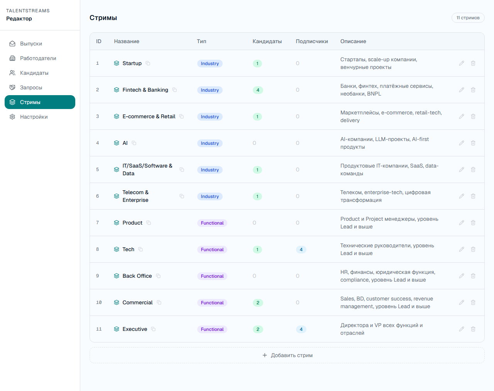
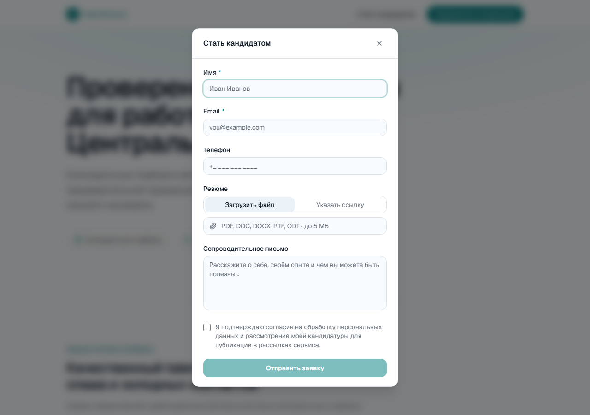
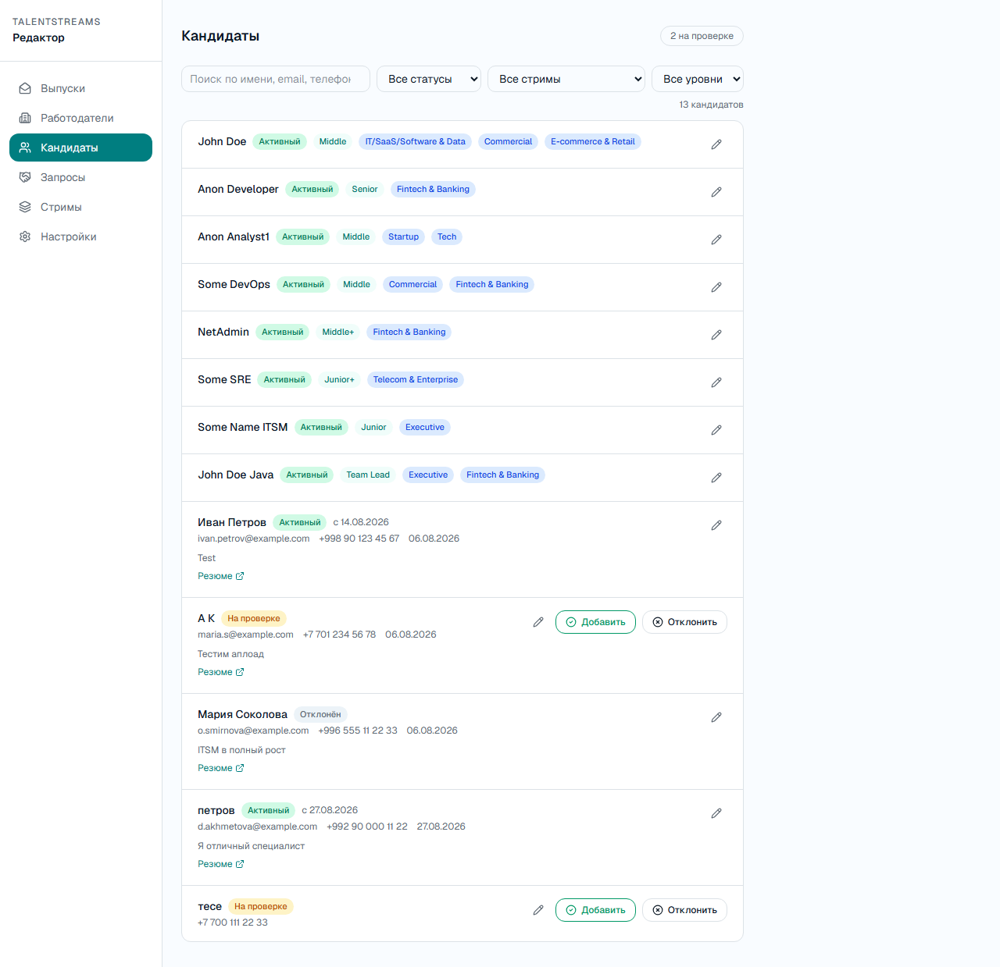
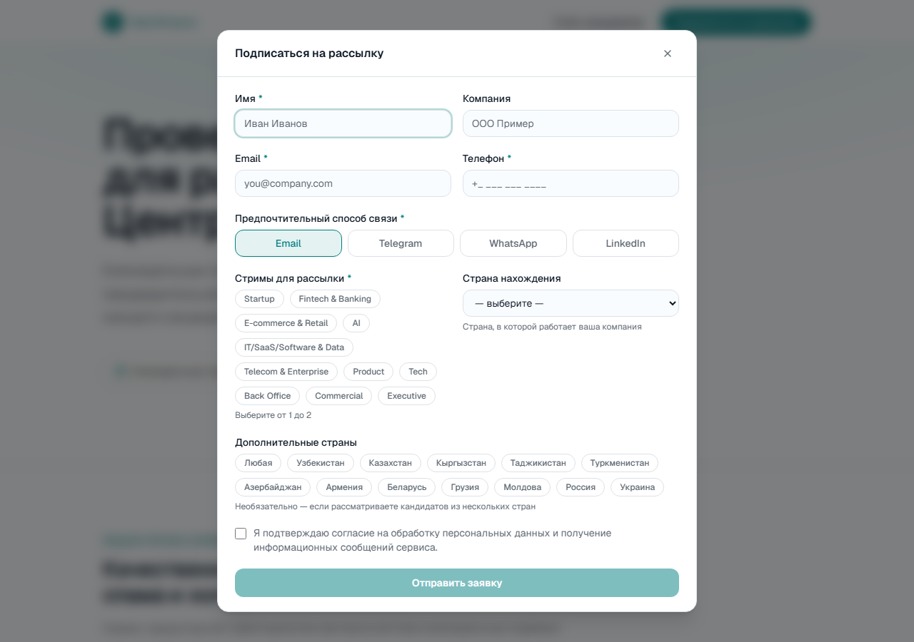
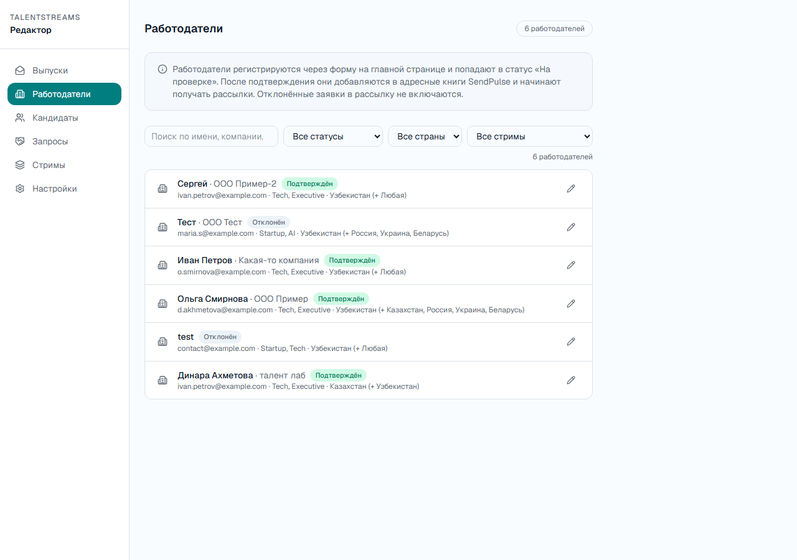
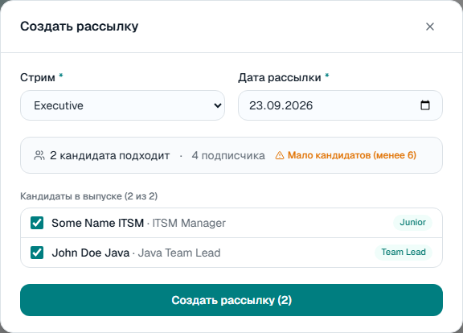
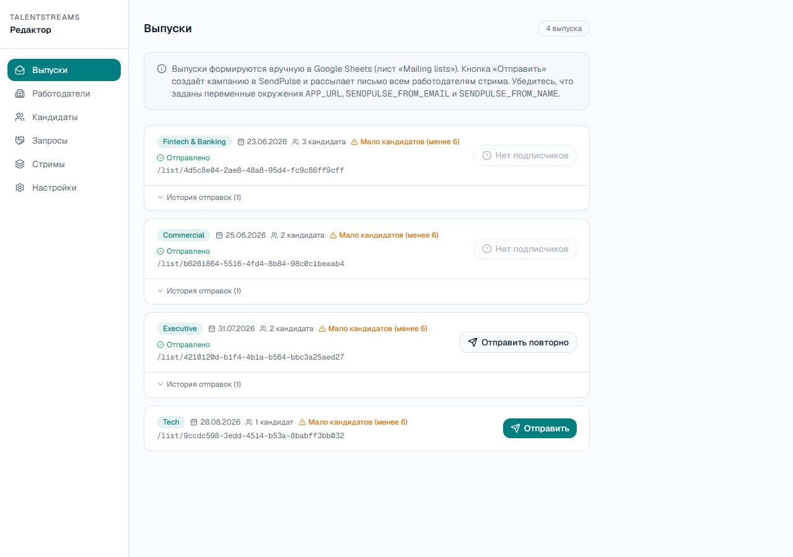

= Плейбук TalentStreams — для менеджера
:toc: left
:toc-title: Содержание
:toclevels: 2
:sectnums:
:icons: font
:lang: ru

Три вещи, которые нужно уметь: занести кандидата, занести работодателя и отправить рассылку по стриму. Ниже — куда кликать, что писать и на чём чаще всего спотыкаются. Без технического жаргона.

== Быстрые ссылки

Сохраните эту страницу и ссылки ниже — они понадобятся почти на каждом шаге.

[cols="1,3", options="header"]
|===
| Что | Ссылка

| Публичный сайт (форма регистрации, подборки)
| https://www.talentlabstreams.com

| Таблица «Candidates Database» — кандидаты
| https://docs.google.com/spreadsheets/d/1Jez_Ql5jWRmOt02sU4ige9wFI6yAjhVDyDUc0-lCJPM/edit#gid=0

| Таблица «Mailing lists» — выпуски рассылок
| https://docs.google.com/spreadsheets/d/1Jez_Ql5jWRmOt02sU4ige9wFI6yAjhVDyDUc0-lCJPM/edit#gid=1270025474

| Админка (редактор) — одобрение, фильтры, рассылка
| https://www.talentlabstreams.com/editor?secret=ВАШ_СЕКРЕТ
|===

IMPORTANT: ❗ `ВАШ_СЕКРЕТ` в ссылке админки — это пароль доступа, свой у компании. Без него редактор не откроется (будет просто «страница не найдена»). Уточните его у *Алексея Калинина* один раз и сохраните ссылку целиком в закладки — дальше при переходах между разделами редактора он сам подставляется во все ссылки.

== Как всё устроено — коротко

Три факта, которые объясняют всё остальное в этой инструкции:

* *Кандидаты живут в Google-таблице* — часть полей можно поправить прямо на сайте в разделе «Редактор», часть — только в самой таблице (ниже для каждого поля указано, где именно). *Работодатели — только на сайте*, отдельной таблицы для них больше нет.
* *Стрим — это направление подборки*, и их ровно 11, список фиксированный (см. ниже). Кандидат и работодатель привязываются к стриму по точному совпадению названия — «Финтех» и «Fintech & Banking» это два разных, не связанных друг с другом слова для системы.
* *Рассылка = «выпуск».* Это подборка кандидатов одного стрима, которую получают по почте все подтверждённые работодатели, подписанные на этот стрим.

=== Список стримов (актуален на сегодня)

Отраслевые (Industry): Startup, Fintech & Banking, E-commerce & Retail, AI, IT/SaaS/Software & Data, Telecom & Enterprise.

По функции (Functional): Product, Tech, Back Office, Commercial, Executive.

Полный список с описаниями и живыми счётчиками — сколько подходящих кандидатов и сколько подтверждённых подписчиков-работодателей у каждого стрима — в разделе «Стримы» редактора:

== Кандидаты — где заполнять и что важно

Есть два способа завести кандидата в системе. На старте, пока вы сами наполняете базу, основным будет второй.

=== Способ А. Кандидат сам подаёт заявку на сайте

На главной странице есть кнопка «Стать кандидатом» — открывается короткая форма (имя, email, телефон, резюме, сопроводительное письмо).

Заявка попадает в таблицу со статусом «На проверке». Дальше её нужно донаполнить и одобрить — см. <<Одобрение и донаполнение — раздел «Кандидаты» на сайте>>.

=== Способ Б. Вы сами вносите кандидата в таблицу

Открываете лист *Candidates Database* (ссылка в <<Быстрые ссылки>>) и добавляете новую строку. Колонки идут в таком порядке:

[cols="2,5,2", options="header"]
|===
| Колонка | Что это |

| `id`
| Служебный код кандидата. Заполняется *сам, автоматически скриптом*, как только вы начинаете вводить новую строку — руками писать не нужно.
| заполняется само

| Кандидат
| Имя. Работодателю не показывается — только для вас.
| правится на сайте

| Роль
| Должность — это работодатель увидит на карточке первым.
| правится на сайте

| Level
| Грейд: Junior / Middle / Senior и т.п. — как договоритесь в команде.
| правится на сайте

| Industry
| Не используется системой нигде.
| можно пропустить

| Function
| Не используется системой нигде.
| можно пропустить

| Country Primary
| Где кандидат находится сейчас.
| правится на сайте

| Country Desired
| Куда хочет переехать/релоцироваться (если применимо).
| правится на сайте

| Stream
| Название стрима из списка выше — *точно как в списке*, без опечаток. Можно указать несколько через запятую — кандидат попадёт сразу в несколько подборок.
| обязательно · правится на сайте

| Summary
| Анонимное описание кандидата — это (вместе с Ролью, Level и страной) *единственное*, что видит работодатель на карточке. Имя, контакты и что угодно личное — не показывается никогда, пока кандидат сам не даст согласие на конкретный запрос.
| правится на сайте

| Excluded Companies / Excluded Industries
| Компании/отрасли, которые кандидат попросил исключить (например, текущего работодателя).
|

| Status
| Пусто или «Активный» — сразу активен и может попасть в рассылку. «На проверке» — не появится нигде, пока вы не одобрите на сайте. «Отклонён» — скрыт.
|

| Active Since
| Дата, с которой кандидат активен. Проставляется автоматически при одобрении на сайте — *только если ячейка была пустая*; если дата уже стоит (например, кандидата до этого отключали и подтверждают заново), сайт её не трогает. Можно и вписать вручную.
| правится на сайте

| Timestamp
| Когда заявка создана — для истории, можно оставить пустым.
|

| Cover Letter / Resume URL / Email / Phone
| Сопроводительное письмо, ссылка на резюме, контакты кандидата.
| правится на сайте
|===

[WARNING]
====
*⚠️ Про колонку `id`*

Специальный скрипт в таблице сам проставляет `id`, как только вы вводите новую строку — отдельно про это думать не нужно.

Единственный момент, когда стоит проверить вручную: если вставляли сразу много строк *пачкой* (скопировали из другого места и вставили разом) — автоматика иногда не успевает сработать на массовую вставку. Если видите кандидата с пустым `id` — он выглядит полностью готовым (статус «Активный», всё заполнено), но никогда не появится ни в подборке, ни в счётчике на странице стримов, ни в рассылке. В этом случае впишите в ячейку что угодно уникальное вручную.
====

=== Одобрение и донаполнение — раздел «Кандидаты» на сайте

Все кандидаты — и с сайта, и внесённые вручную — видны в редакторе. Сверху панель фильтров (поиск, статус, стрим, уровень), справа от каждой строки — карандаш для редактирования и кнопки «Добавить» / «Отклонить» для тех, кто «На проверке».

Карандаш открывает форму с именем, ролью, email, телефоном, резюме, сопроводительным письмом, summary, уровнем, стримами, страной и датой активности — включая *Роль* и *Summary*, то есть всё, что реально видит работодатель на карточке. Через сайт не редактируются только `Industry`/`Function` (система их сейчас нигде не использует) — они правятся напрямую в таблице, если вообще нужны.

== Работодатели — где заполнять и что важно

В отличие от кандидатов, здесь только один способ — форма на сайте. Отдельной таблицы для ручного ввода работодателей нет.

Кнопка «Подписаться на рассылку» в шапке сайта — форма собирает имя, компанию, контакты, способ связи, до двух стримов и страну/страны.

Заявка сразу видна в редакторе со статусом «На проверке». Служебный идентификатор (по нему строится персональная ссылка на подборку и связь с рассылкой) форма генерирует сама при отправке, каждый раз без исключений — прежней подстраховки «на случай, если скрипт не сработал при массовой вставке» здесь больше не нужно.

=== Подтверждение — раздел «Работодатели» на сайте

Здесь та же панель фильтров (поиск, статус, страна, стрим), карандаш для редактирования любых полей кроме статуса, и кнопки «Подтвердить»/«Отклонить» для заявок «На проверке».

[NOTE]
====
*ℹ️ Что реально происходит по клику «Подтвердить»*

Работодатель добавляется в базу рассылки (SendPulse) и сразу же автоматически получает приветственное письмо. Нажимайте только когда контакты и стримы точно верны — отменить отправку письма потом нельзя, только откорректировать данные на будущее.
====

== Как сделать рассылку

Рассылка = «выпуск»: подборка кандидатов одного стрима на конкретную дату. Работодатели, подтверждённые и подписанные на этот стрим, получат письмо со ссылкой.

=== Способ А (рекомендуемый). Кнопка «Создать рассылку»

В разделе «Выпуски» — кнопка «Создать рассылку». Открывается форма:

. Выберите *стрим* и *дату*.
. Сайт сам покажет, сколько кандидатов подходит и сколько подтверждённых подписчиков-работодателей у этого стрима — те же жёлтые/красные предупреждения, что и при ручном способе (меньше 6 или больше 10 кандидатов, 0 подписчиков), только сразу, до создания выпуска, а не после.
. Ниже — список подходящих кандидатов с галочками, все отмечены по умолчанию. Уберите галочку у тех, кого не хотите включать в этот выпуск.
. Нажмите «Создать рассылку» — выпуск появится в списке ниже, дальше как обычно: «Отправить».

IMPORTANT: ❗ В список автоматически попадают только кандидаты нужного стрима со статусом «Активный», у которых дата «Активен с» уже наступила (или вообще не проставлена). Кандидат, у которого дата в будущем (например, «на паузе» после недавней публикации), в списке не появится — это осознанно, не ошибка.

=== Способ Б. Вручную в таблице «Mailing lists»

Тот же результат можно собрать напрямую в таблице — например, если нужно добавить кандидата, которого автоматика не предложила.

. *Проверьте, сколько активных кандидатов подходит под стрим.* +
В разделе «Стримы» у каждого стрима зелёный кружок с числом — это те, кто уже привязан к нему и активен.

. *Соберите выпуск в таблице «Mailing lists».* +
На каждого кандидата — отдельная строка: `List ID` · `Stream` (точное название) · `Date` · `Candidate ID` (тот самый `id` из таблицы кандидатов — вот почему он обязателен). +
+
`List ID` у всех строк одного выпуска должен быть *одинаковый* — так система понимает, что это один и тот же выпуск. Заполняется он тем же скриптом: в первой строке выпуска оставьте ячейку пустой — он сам подставит значение. В остальных строках этого же выпуска *скопируйте это же значение вручную* — если оставить пустым, скрипт сгенерирует для каждой строки свой, отдельный id, и кандидаты разъедутся по разным несуществующим выпускам вместо одного общего. Способ А (кнопка) от этой ошибки застрахован — id генерируется один раз и на всех строках гарантированно одинаковый.

=== Отправка (общий шаг для обоих способов)

. *Откройте раздел «Выпуски» на сайте.* +
Новая карточка появится по вашему `List ID`. Если кандидатов меньше 6 или больше 10 — увидите жёлтое предупреждение прямо на карточке, это не блокирует отправку. +
+

. *Нажмите «Отправить».* +
Если у стрима нет ни одного подтверждённого подписчика, кнопка покажет «Нет подписчиков» и не даст отправить — тогда сначала подтвердите работодателей. Уже отправленный выпуск можно отправить повторно кнопкой «Отправить повторно».

Работодатель получает письмо со ссылкой на персональную подборку (без точного числа кандидатов текстом — специально, чтобы не давать обещаний, которые может не выполнить гео-фильтр). Перейдя по ссылке, он видит анонимные карточки: должность, уровень, страна, теги стримов, краткое summary — без имён и контактов.

TIP: Ошиблись в выпуске, который ещё не отправляли (неважно, собрали его кнопкой или вручную в таблице)? Рядом с «Отправить» — корзина: подтвердите удаление, и все строки выпуска пропадут из «Mailing lists». Как только выпуск отправлен хотя бы раз, корзина исчезает — удалить отправленный выпуск через сайт нельзя (кампания уже ушла работодателям, удаление из таблицы это не отменит).

== Шпаргалка

=== Перед тем как закрыть таблицу кандидата

* `id` проставился сам (проверьте, если вставляли строки пачкой) — без него кандидата никогда не будет видно
* `Stream` совпадает с названием из списка дословно
* `Summary` написан — это единственное, что увидит работодатель
* Статус выставлен осознанно (пусто/Активный = сразу виден)

=== Перед тем как подтвердить работодателя

* Email и телефон верны — подтверждение необратимо шлёт письмо
* `Streams` совпадают с названиями из списка

=== Перед отправкой рассылки

* У стрима есть хотя бы несколько активных кандидатов
* У стрима есть хотя бы один подтверждённый подписчик
* Если собирали через кнопку «Создать рассылку» — это уже видно в форме до создания, отдельно проверять не нужно
* Если собирали вручную в таблице: `Candidate ID` совпадают с `id` из таблицы кандидатов, и у всех строк одного выпуска — одинаковый `List ID` (скопирован вручную, кроме первой строки)

== Если что-то не так

Не открывается редактор, ссылка на подборку не работает, письмо не пришло — не гадайте, что сломалось: сразу к *Алексею Калинину*. Почти всегда причина одна из трёх в шпаргалке выше.
